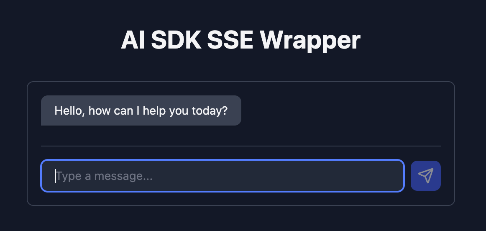

# Agent SSE Protocol Exploration

Most agent SDKs and APIs make strong, inflexible assumptions about the state of your system and the protocol used to stream it. This is an exploration of reclaiming ownership over the form and streaming protocol of that state.


## Run the demo



To install dependencies:

```bash
bun install
```

To start a development server:

```bash
bun dev
```

This project was created using `bun init` in bun v1.3.1. [Bun](https://bun.com) is a fast all-in-one JavaScript runtime.
